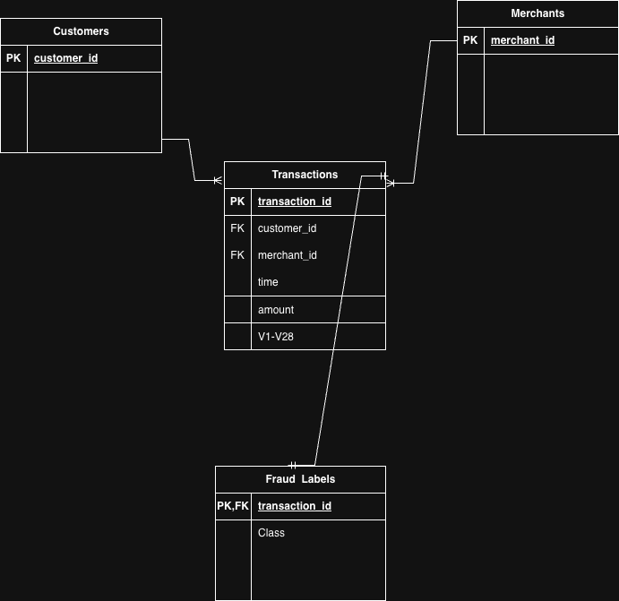

# DS 4320 Project 1: Credit Card Fraud Detection

## Executive Summary
It's a relational data science project involving credit card fraud detection. Contents of this repository include the structured dataset stored on UVA OneDrive, Python scripts used to convert raw data into a relational database, DUCKDB based machine learning pipeline in notebook and markdown versions, and press release aimed at general audiences. The purpose of this project was to find out if transaction-level data can be analyzed to detect fraudulent credit card transactions.

## Name
Wissal Khlouf

## NetID
hta4yb

## DOI 
10.5281/zenodo.19362866

## Problem Definition

### Initial General Problem
Detecting credit card fraud.

### Refined Specific Problem
Create a model that can determine if a credit card transaction is fraudulent based off of transaction-level data.

### Rationale for Refinement
Credit card fraud detection was made more specific because the general task can include different institutions, data sources, types of fraud, etc. Limiting it to transaction level prediction will make it more measurable/formattable to the data science workflow. From here, we will be able to answer if we can predict fraud with numerical features given about each transaction.

### Motivation
Credit card frauds can lead to monetary losses for banks, payment processors, and customers. Since they are often disguised as legitimate transactions, frauds are hard to catch in a quick fashion and with high accuracy. This project seeks to help with fraud screening and answer if we can detect fraud based off of historical transactions.

### Press Release
**Headline:** New Data Pipeline Helps Identify High-Risk Credit Card Transactions  
[Read the press release](docs/press_release.md)

---

## Domain Exposition

### Terminology

| Term | Meaning |
|------|--------|
| Fraud | Unauthorized or suspicious credit card transaction |
| Transaction | A single payment made using a credit card |
| Feature | Input variable used in the model (e.g., V1–V28, Amount) |
| Label | Output variable indicating fraud (1) or not fraud (0) |
| Class Imbalance | Situation where fraud cases are much rarer than non-fraud |
| Precision | How many predicted fraud cases are actually fraud |
| Recall | How many actual fraud cases are correctly detected |
| Confusion Matrix | Table showing correct vs incorrect predictions |

### Domain Description
The objective of this project falls under financial fraud detection. Transaction data is reviewed by financial institutions to determine any suspicious activity that may decrease loss due to fraud. Fraud detection itself is difficult as the occurrence of fraud is extremely low when compared to the amount of non-fraudulent transactions. Class imbalance datasets are prevalent within this practice. Machine learning can be leveraged to help discover patterns in transaction activity and flag potentially high risk transactions for further investigation.

### Background Reading Summary

| Paper Title | Description | Link |
|-----|-----|-----|
| Fraud Detection Overview | This article contains background information about some of the most widely used fraud detection methods employed by banks. | [link](docs/background_readings/fraud_detection_overview.pdf |
| Banking Fraud Statistics | General information about fraud within financial institutions. | [link](docs/background_readings/banking_fraud_statistics.pdf |
| Machine Learning & Fraud Detection | This paper goes over machine learning algorithms being used to predict fraud. |[link](docs/background_readings/machine_learning_fraud_detection.pdf |
| Anomaly Detection and Fraud | This article reviews how anomaly detection can be used to detect fraud through suspicious transactions. | [link](docs/background_readings/anomaly_detection_finance.pdf |
| Fraud Prevention | Overview of techniques used to help prevent fraud. | [link](docs/background_readings/fraud_prevention_strategies.pdf |

---

## Data Creation

### Provenance

The dataset was acquired from a public credit card fraud dataset available on Kaggle.com. This dataset provides transactions made by European cardholders that have been processed through PCA and anonymized. Features provided include PCA transformed numerical features, time of transaction, transaction amount, and if the transaction was fraudulently labeled. The dataset was received as a single flat file and was changed to have a relational form.

### Code Table

| File | Description | Link |
|------|------------|------|
| build_tables.py | Converts original dataset into relational tables | [link](src/build_tables.py) |
| create_samples.py | Generates smaller sample datasets for GitHub use | [link](src/create_samples.py) |

### Bias Identification

Two issues that come up with this dataset are an extremely unbalanced distribution of fraud versus non-fraud transactions, which can lead models to be biased towards predicting no fraud. The use of PCA transformed features also decreases the interpretability of our data and could mask bias in the original features.

### Bias Mitigation

Class imbalance problem was handled by using precision and recall as evaluation metrics instead of accuracy. Model uses class weighting to focus more on minority class which is fraud. Stratified sample method was used for train-test splitting.

### Rationale for Design Decisions

That initial dataset was a single table, a format that didn't adhere to relational database principles. In order to meet project specifications, the dataset was restructured into transaction, customer, merchant, and fraud label tables. Because the dataset did not include explicit customer or merchant information, synthetic identifiers were generated to simulate realistic relationships. These design choices allow the dataset to behave like a structured database while preserving the original transaction data.

---

## Metadata

### ER Diagram

### Data Tables

| Table | Description | Link |
|------|------------|------|
| transactions | Main transaction-level dataset with features | [link](data/sample_transactions.csv) |
| customers | Synthetic customer table | [link](data/sample_customers.csv) |
| merchants | Synthetic merchant table | [link](data/sample_merchants.csv) |
| fraud_labels | Fraud classification labels | [link](data/sample_fraud_labels.csv) |

### Data Dictionary

| Feature | Type | Description | Example |
|--------|------|------------|--------|
| transaction_id | int | Unique transaction identifier | 1001 |
| amount | float | Transaction amount | 149.62 |
| time | float | Time since first transaction | 12345 |
| V1–V28 | float | PCA-transformed features | -1.35 |
| Class | int | Fraud label (1 = fraud, 0 = not fraud) | 0 |

### Uncertainty in Numerical Features
The majority of numerical features are products of PCA which means we don't know what they represent. This could cause issues when we don't know what the data means. Transaction data can also be noisy. 

---

## Links
- **Press Release:** [press_release.md](docs/press_release.md)
- **Data Folder:** [UVA OneDrive Data Folder](https://myuva-my.sharepoint.com/:f:/g/personal/hta4yb_virginia_edu/IgDn78txeup2TJ6ZO7KaxKYxAVmvTCrzxdH-kM5ACP7pm_0?e=xxLt6D)
- **Pipeline Notebook:** [pipeline.ipynb](pipeline/pipeline.ipynb)
- **Pipeline Markdown:** [pipeline.md](pipeline/pipeline.md)
- **License:** [MIT License](LICENSE)